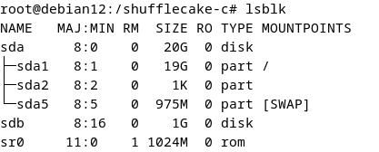
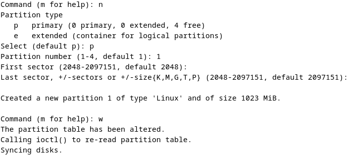
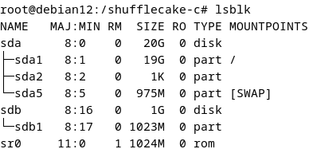
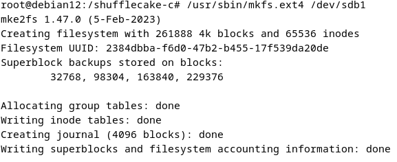
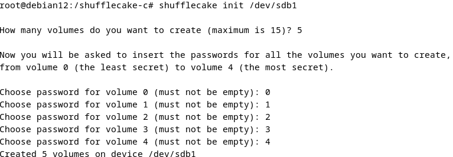
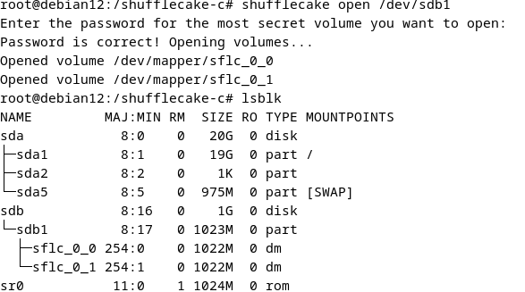
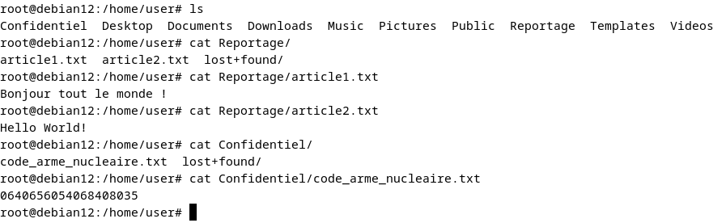
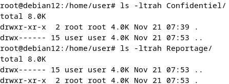
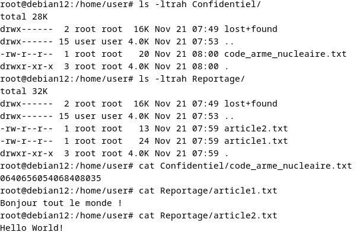


Dans un monde où la confidentialité des données est de plus en plus menacée, l’utilisation d’outils de chiffrement devient essentielle. Ces outils permettent de protéger les informations sensibles en les rendant illisibles pour toute personne non autorisée. Ils sont particulièrement précieux pour les lanceurs d’alerte, les journalistes d’investigation et les militants des droits de l’homme opérant dans des régimes oppressifs, où la sécurité des communications peut être une question de vie ou de mort. De plus, toute organisation, qu’elle soit une entreprise, une institution gouvernementale ou une ONG, a besoin d’un certain niveau de sécurité pour ses données afin de prévenir les fuites d’informations, les cyberattaques et les violations de la vie privée.

Le chiffrement assure que seules les personnes disposant de la clé de déchiffrement peuvent accéder aux données protégées, garantissant ainsi leur intégrité et leur confidentialité. En somme, il s’agit d’un outil indispensable pour toute entité soucieuse de la sécurité de ses informations.

Au travers de l’outil de chiffrement `Shufflecake` nous allons voir comment se protéger. L’outil fonctionnant sur n’importe quel système de fichiers, écrit en C par Elia Anzuoni et Tommaso “tomgag” Gagliardonipour. Un portage vers Rust semble envisagé pour le futur, a l’heure actuelle il est toujours en cours de developpement.


## Une petite histoire...

Il serait potentiel successeur à TrueCrypt (qui est plus connu sous le nom de VeraCrypt maintenant), le développement de TrueCrypt ayant été interrompu et la dernière version parue n'étant plus celle disponible auprès du public, ce qui est assez étonnant.

TrueCrypt était un logiciel de chiffrement de disque très populaire, utilisé par des millions de personnes pour protéger leurs données sensibles. Cependant, en mai 2014, le site officiel de TrueCrypt a soudainement affiché un message indiquant que le développement du logiciel avait été arrêté et que TrueCrypt n'était plus sûr à utiliser. Le message recommandait aux utilisateurs de migrer vers des solutions alternatives comme BitLocker de Microsoft.

Cette annonce a suscité de nombreuses spéculations et théories. Certains ont suggéré que les développeurs de TrueCrypt avaient été contraints d'arrêter le développement en raison de pressions gouvernementales ou de mandats secrets. D'autres ont émis l'hypothèse que des vulnérabilités critiques avaient été découvertes dans le logiciel, rendant son utilisation dangereuse. Peu de temps après l'arrêt de TrueCrypt, un projet open-source appelé VeraCrypt a émergé. VeraCrypt est basé sur le code source de TrueCrypt, mais avec des améliorations significatives en termes de sécurité et de fonctionnalités. Les développeurs de VeraCrypt ont corrigé plusieurs vulnérabilités découvertes dans TrueCrypt et ont ajouté des fonctionnalités supplémentaires pour renforcer la sécurité. VeraCrypt a rapidement gagné en popularité en tant que successeur de TrueCrypt, offrant une solution de chiffrement de disque fiable et sécurisée. Le projet est activement maintenu et mis à jour par une communauté de développeurs dédiée, assurant ainsi que les utilisateurs disposent d'un outil de chiffrement moderne et sécurisé.

En parallèle, des audits de sécurité indépendants ont été réalisés sur le code source de VeraCrypt pour garantir son intégrité et sa sécurité. Ces audits ont contribué à renforcer la confiance des utilisateurs dans le logiciel.

Aujourd'hui, VeraCrypt est largement utilisé par des particuliers, des entreprises et des organisations pour protéger leurs données sensibles. Il est disponible sur plusieurs plateformes, y compris Windows, macOS et Linux, et continue d'évoluer pour répondre aux besoins de sécurité des utilisateurs.

**En résumé**, bien que l’arrêt fut soudain, surprenant et mystérieux de TrueCrypt; VeraCrypt quand a lui émergé comme un digne successeur, offrant une solution de chiffrement de disque sécurisée et fiable pour les utilisateurs du monde entier.

## Le projet

Avant de commencer à utiliser Shufflecake, il est important de comprendre ses principaux concepts nous permettant de conceptualiser ses scénarios d’utilisation.


L’idée derrière le logo est de visualiser nos volumes en plusieurs couches qui s’ouvriraient avec un mot de passe par couche.

Un mot de passe permet d’accéder jusqu’à son niveau, si on a 15 niveaux et que l’on souhaite aller au 3ème, on utilisera notre 3ème mot de passe qui déverrouillera nos données sur 3 niveaux directement. On peut ainsi graduellement stocker nos informations en fonction de leurs importances. Le logiciel en soi ne peut pas être caché lors d’un scan, par contre le nombre de volumes caché quant à lui ne peut être deviné, ce qui en fait sa force. L’outil est pour l’instant limité à 15 couches.

### Le déni plausible

Un des concepts est de pouvoir effectuer un deni plausible, mais qu’est-ce qu’un deni plausible ?

Le **déni plausible** ou **possibilité de nier de façon plausible** (« ***plausible deniability*** »en anglais) est la possibilité, notamment dans le droit américain, pour des individus (généralement des responsables officiels dans le cadre d'une hiérarchie formelle ou informelle) de nier connaître L'existence d'actions condamnables commises par d'autres dans une organisation hiérarchique ou d'en être responsable si des preuves pouvant confirmer leur participation sont absentes, et ce même s'ils ont été personnellement impliqués ou ont volontairement ignoré ces actions.

### Qu’est-ce que l’ORAM(Oblivious Random Access Machine) ?

Si l'ORAM ne vous dit rien, nous allons l'aborder lors de ce chapitre. J'ai pu découvrir ce terme lors de mes recherches pour cet article.

Récemment, la `mémoire vive inconsciente (ORAM)` est un point qui attire l’attention, car il s'agit d'un outil cryptographique idéal pour masquer les modèles d'accès (access paterns)

Une des fonctions primaires d’un cloud est le partage des données, qui est liée à l'évolutivité et à la mutualisation du cloud computing. Ne sachant pas si les données sont bien sécurisées, dans le cloud, on pourrait avoir tendance à vouloir pour des raisons de sécurité et de confidentialité chiffrer nos données. Cependant, les schémas de partage de données existants basés sur l'ORAM comportent diverses failles.

**une grande complexité de calcul ou une forte dépendance de primitives de cryptographie complexes** (”À la création d’un système cryptographique.
 (ou cryptosystème), le concepteur se fonde sur des briques appelées « primitives cryptographiques ». Pour cette raison, les primitives cryptographiques sont conçues pour effectuer une tâche précise et ce de la façon la plus fiable possible.”). 

Dans le cas de Shufflecake, il a été décidé de ne pas opter pour le modèle de l'ORAM, même si l’utilisation de l’ORAM pour accéder à un disque garantit qu’aucune entité, y compris une backdoor runtime dans le firmware du dispositif (un programme malveillant permettant un accès non autorisé à un système informatique pendant son fonctionnement), ne peut déterminer quel volume a été utilisé ni comment il l’a été. Un des facteurs pour ne pas l'adopter est sa lenteur. Je suppose que la puissance de calcul requise pour son fonctionnement ne serait pas optimale pour le résultat souhaité (fonctionner sur un ordinateur "classique").

### Problèmes pour la mise en production:

Shufflecake est actuellement en cours de développement et présente encore quelques bugs. En raison de son état de développement, il peut parfois écrire par-dessus des données qu’il ne devrait pas modifier. Cela signifie qu’il peut accidentellement altérer ou supprimer des informations importantes, ce qui le rend inadapté pour une utilisation en production à ce stade.

En ce qui concerne les attaques multi-snapshot adverses (TRIM), il s’agit d’une technique utilisée par des attaquants pour contourner les mécanismes de sécurité des systèmes de stockage. Les snapshots sont des copies instantanées de l’état d’un système à un moment donné. Les attaquants peuvent créer plusieurs snapshots pour analyser les différences entre eux et ainsi déduire des informations sensibles ou contourner des protections. L’outil en question ne dispose pas encore de mécanismes pour se défendre contre ce type d’attaque, ce qui représente une vulnérabilité importante.

Enfin, il est crucial de noter que l’outil ne protège pas contre les trojans et les keyloggers. Les trojans sont des logiciels malveillants qui se déguisent en programmes légitimes pour infecter un système, tandis que les keyloggers enregistrent les frappes au clavier pour voler des informations sensibles comme des mots de passe. L’absence de protection contre ces menaces signifie que les utilisateurs doivent être particulièrement vigilants et utiliser des solutions de sécurité complémentaires pour se protéger.

## Prérequis
**Dépendances à installer**
```shell
sudo apt update

sudo apt upgrade

sudo apt install linux-headers-$(uname -r) libdevmapper-dev libgcrypt-dev make gcc git
```

**On récupère les binaires de ShuffleCake**
```shell
git clone https://codeberg.org/shufflecake/shufflecake-c.git
```

**Il faut chargé le module kernel**`dm-sflc`
Shufflecake a 2 composants : **dm**, un module kernel implémenté dans Shufflecake scheme comme un device-mapper visant le kernel de Linux, le second est `shufflecake-userland`, un outil permettant à l'utilisateur de créer et gérer des volumes caches.
*Le module du kernel DOIT être en service avant l'utilisation de l'outil userland.*

```shell
sudo insmod dm-sflc.ko
```

**Paramétrage**
```shell
sudo chown user shufflecake-c/ -R

cd shufflecake-c

make

sudo cp ./shufflecake /usr/bin/

sudo chown 777 /usr/bin/shufflecake
```

### Commandes principales pour l'utilisation de l'outil
**Préparation du volume chiffré**
```shell
sudo shufflecake init <block_device>
```

**Ouverture de n volume, chiffrement en fonction du mot de passe**
```shell
sudo shufflecake open <block_device>
```

**Fermeture des volumes**
```shell
sudo shufflecake close <block_device>
```
**Changement du mot de passe**
Il faut saisir le mot de passe actuel et ensuite remplacer par un nouveau.
```shell
shufflecake changepwd <block_device>
```

### Cas concret
Dans ce cas d'utilisation concret de la solution, j'ai au préalable pour cette démo ajouté un disque à la vm.
Je suis sur une vm en `Debian12.8.0-amd64-netinst.iso`, la vm à 4 Go de RAM, 2 VCPU ainsi que 20 Go de RAM et un second disque de 1Go.
```shell
root@debian12:/shufflecake-c# cat /proc/version
Linux version 6.1.0-27-amd64 (debian-kernel@lists.debian.org) (gcc-12 (Debian 12.2.0-14) 12.2.0, GNU ld (GNU Binutils for Debian) 2.40) #1 SMP PREEMPT_DYNAMIC Debian 6.1.115-1 (2024-11-01)
```

On peut voir notre disque fraichement monté.


On va commencer par préparer notre disque.
```shell
/usr/sbin/fdisk sdb
```
Tapez n pour créer une nouvelle partition.
Sélectionnez p pour une partition primaire.
Choisissez 1 pour le numéro de partition.
Définissez la taille, faire [enter] et encore [enter]. Cela prendra la taille par défaut.
Tapez w pour écrire les modifications et quitter.


On a retrouve bien notre sdb1.


Maintenant on va le formater dans le type ext4 par exemple.


On va initier notre volume, ce qui va nous créer cinq volumes chifrées dans cet exemple


On va ouvrir notre volume pour y mettre ou consulter des informations. Ici on peut voir que seulement deux volumes sont ouverts sur les cinq. J'ai donné le mot de passe du deuxième ce qui a ouvert les 2 premières couches.


Dans Shufflecake les périphériques se comportent comme si ils étaient virtuels. On les retrouvera donc dans "/dev/mapper/" au lieu de "/dev" par défaut.

```shell
root@debian12:/home/user# ls /dev/mapper/
control  sflc_0_0  sflc_0_1
```
Ces volumes nouvellement créés n'ont pas de formats, ils ont besoin d'être formatés pour être utilisés.
```shell
/usr/sbin/mkfs.ext4 /dev/mapper/sflc_0_0
/usr/sbin/mkfs.ext4 /dev/mapper/sflc_0_1
```
Il ne reste plus que a monté le/les volumes.
```shell
mkdir /home/user/Reportage
mkdir /home/user/Confidentiel
mount /dev/mapper/sflc_0_0 /home/user/Reportage
mount /dev/mapper/sflc_0_1 /home/user/Confidentiel
```

Mise en place de fichiers
```shell
nano /home/user/Reportage/article1.txt
nano /home/user/Reportage/article2.txt
nano /home/user/Confidentiel/code_arme_nucleaire
```
On a l'ensemble de ces documents avant fermeture des volumes chifrées.


Actuellement pour prévenir de possible perte de données, il faut au préalable détaché notre/nos volumes.
```shell
umount /home/user/Reportage
umount /home/user/Confidentiel
```

Fermeture de nos volumes.
```shell
sudo shufflecake close /dev/sdb1
```
Nos fichiers sont bel et bien cachés.


On va venir ouvrir à nouveau nos volumes
```shell
shufflecake open /dev/sdb1
mount /dev/mapper/sflc_0_0 /home/user/Reportage
mount /dev/mapper/sflc_0_1 /home/user/Confidentiel
```
On retrouve bien nos documents !


**Après utilisation de l'outil on peut enlever le module** `dm-sflc`
```shell
sudo rmmod dm-sflc
```

### Benchmarks
En termes de performances que vaut l'outil ?
Nous allons comparer trois outils: Cryptsetup, shufflecake legacy et veracrypt.

Cryptsetup outil utilisé pour créer et gérer des volumes chiffrés selon le standard LUKS
```shell
root@debian12:/shufflecake-c/benchmark-suite# ls
INSTRUCTIONS.md  luks-benchmark.sh  sflc-legacy-benchmark.sh  sflc-legacy-fragmentation.sh  sflc-lite-benchmark.sh  sflc-lite-fragmentation.sh	veracrypt-benchmark.sh
root@debian12:/shufflecake-c/benchmark-suite# sudo ./luks-benchmark.sh 
===============================================================================
                    Benchmark Suite Script for LUKS/dm-crypt
===============================================================================
 
Now you will be asked to enter the path for a block device to be used for the 
benchmarks (all content will be erased). If no path is provided (default
choice), then the script will create a 1 GiB file in the current directory and 
use it to back a loop device instead, then the file will be removed at the end.
 
Please enter the path for a block device (default: none): 
No path provided, creating a local file and loop device...
I will now try to create a file /shufflecake-c/benchmark-suite/luks-benchmark-loop-file.img ...
1024+0 records in
1024+0 records out
1073741824 bytes (1.1 GB, 1.0 GiB) copied, 15.0888 s, 71.2 MB/s
Writing of empty file complete. I will now try to attach it to a new loop device...
Successfully created loop device /dev/loop0 .
OK, block device path /dev/loop0 is valid.
Are you sure you want to proceed? All data on disk /dev/loop0 will be erased. (y/n)
y
Starting benchmark for LUKS/dm-crypt...
Initializing block device /dev/loop0 as a LUKS volume...
Action luksFormat took 13.512 seconds.
LUKS device initialized. Opening encrypted volume...
Action luksOpen took 2.389 seconds.
LUKS volume opened as /dev/mapper/luks-test. Formatting with ext4...
mke2fs 1.47.0 (5-Feb-2023)
Volume /dev/mapper/ formatted. Mounting that...
Volume mounted at /shufflecake-c/benchmark-suite/luks_mnt. Starting fio tests...
Test 01: random read with a queue of 32 4kiB blocks on a file (20s)...
./luks-benchmark.sh: line 173: fio: command not found

Test 02: random write with a queue of 32 4kiB blocks on a file (20s)...
./luks-benchmark.sh: line 177: fio: command not found

Test 03: sequential read with a queue of 32 4kiB blocks on a file (20s)...
./luks-benchmark.sh: line 181: fio: command not found

Test 04: sequential write with a queue of 32 4kiB blocks on a file (20s)...
./luks-benchmark.sh: line 185: fio: command not found

LUKS/dm-crypt fio tests ended. Unmounting volume.
Volume unmounted. Closing LUKS device...
Action close took 0.076 seconds.
Exiting and cleaning...
Detaching /dev/loop0 ...
Deleting /shufflecake-c/benchmark-suite/luks-benchmark-loop-file.img ...
Loop device detached and backing file deleted.
```

## Conclusion
L’évolution de cet outil mérite une attention particulière, compte tenu de ses ambitions dans le domaine du chiffrement des données. Shufflecake se positionne ainsi comme un successeur prometteur de TrueCrypt, offrant des promesses de fonctionnalitées avancées et une sécurité renforcée. Son développement continu pourrait apporter des innovations significatives et répondre aux besoins croissants en matière de protection des informations sensibles.

## Webographie

Lien vers le site officiel:[https://shufflecake.net/](https://shufflecake.net/)

Lien vers Codeberg:[https://codeberg.org/shufflecake/shufflecake-c](https://codeberg.org/shufflecake/shufflecake-c)

Lien vers la partie algorithmitque de l'outil:[https://arxiv.org/html/2310.04589v2](https://arxiv.org/html/2310.04589v2)

Lien vers un article amazon sur l'ORAM
[docamazon](https://docs.aws.amazon.com/prescriptive-guidance/latest/dynamodb-data-modeling/step3.html)

Lien vers la cryptographie wikipedia
[système cryptographique](https://fr.wikipedia.org/wiki/Cryptosyst%C3%A8me)

Paf LeGeek-Nier l'existence d'un disque chiffré : [lien](https://www.youtube.com/watch?v=Bp3yjRVNK3o&t=514s&pp=ygULc2h1ZmZsZWNha2U%3D)